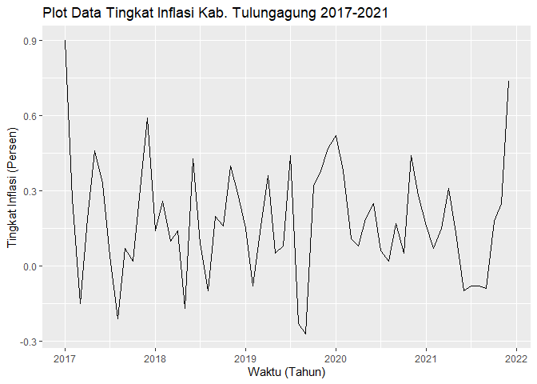
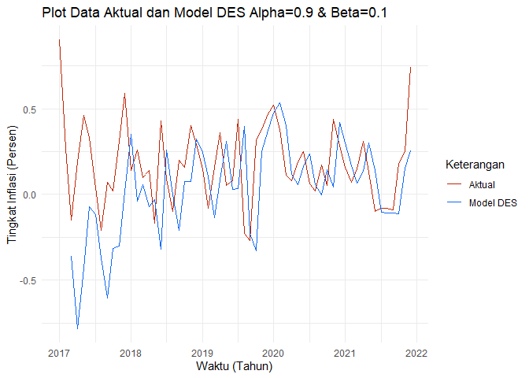
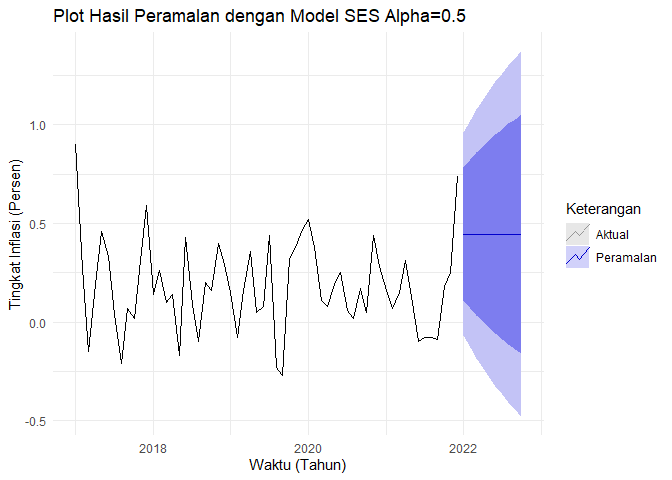
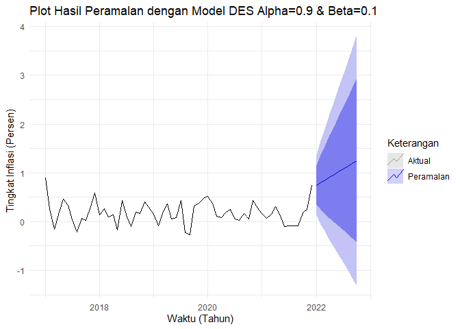
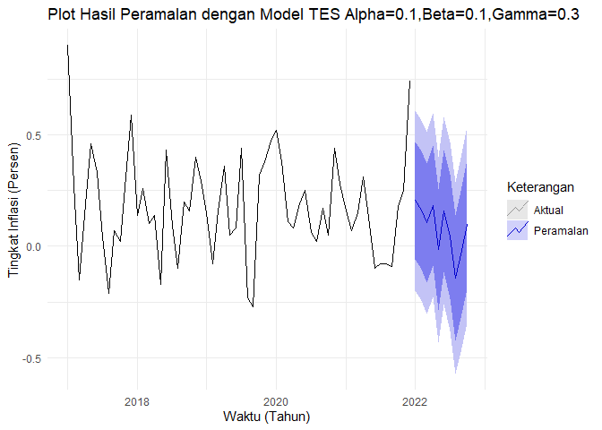

Peramalan Tingkat Inflasi Kabupaten Tulungagung dengan Exponential
Smoothing
================
Ndaru
April 26, 2022

# Data

Data yang digunakan merupakan data tingkat inflasi Kabupaten Tulungagung
sejak **Januari 2017** sampai dengan **Desember 2021** sehingga
diperoleh **60 data**.

# Impor Data

Melakukan impor data dari file csv

``` r
inflasi=read.csv("data_inflasi.csv")
```

# Melihat Data

Melihat enam data awal yang telah diimpor

``` r
head(inflasi)
```

    ##     bulan inflasi
    ## 1 2017-01    0.90
    ## 2 2017-02    0.27
    ## 3 2017-03   -0.15
    ## 4 2017-04    0.19
    ## 5 2017-05    0.46
    ## 6 2017-06    0.33

# Mengaktifkan Library

Library yang akan digunakan perlu diaktifkan terlebih dahulu

``` r
library(plotly)
```

    ## Loading required package: ggplot2

    ## 
    ## Attaching package: 'plotly'

    ## The following object is masked from 'package:ggplot2':
    ## 
    ##     last_plot

    ## The following object is masked from 'package:stats':
    ## 
    ##     filter

    ## The following object is masked from 'package:graphics':
    ## 
    ##     layout

``` r
library(forecast)
```

    ## Warning: package 'forecast' was built under R version 3.6.3

    ## Registered S3 method overwritten by 'quantmod':
    ##   method            from
    ##   as.zoo.data.frame zoo

``` r
library(xts)
```

    ## Warning: package 'xts' was built under R version 3.6.3

    ## Loading required package: zoo

    ## Warning: package 'zoo' was built under R version 3.6.3

    ## 
    ## Attaching package: 'zoo'

    ## The following objects are masked from 'package:base':
    ## 
    ##     as.Date, as.Date.numeric

``` r
library(Metrics)
```

    ## Warning: package 'Metrics' was built under R version 3.6.3

    ## 
    ## Attaching package: 'Metrics'

    ## The following object is masked from 'package:forecast':
    ## 
    ##     accuracy

# Mengubah ke Time Series

Mengubah data menjadi *time series* (runtun waktu)

``` r
inflasi.ts <- ts(inflasi$inflasi,  start = c(2017,1), frequency = 12)
inflasi.ts
```

    ##        Jan   Feb   Mar   Apr   May   Jun   Jul   Aug   Sep   Oct   Nov
    ## 2017  0.90  0.27 -0.15  0.19  0.46  0.33  0.04 -0.21  0.07  0.02  0.31
    ## 2018  0.14  0.26  0.10  0.14 -0.17  0.43  0.09 -0.10  0.20  0.16  0.40
    ## 2019  0.15 -0.08  0.16  0.36  0.05  0.08  0.44 -0.23 -0.27  0.32  0.38
    ## 2020  0.52  0.38  0.11  0.08  0.19  0.25  0.06  0.02  0.17  0.05  0.44
    ## 2021  0.16  0.07  0.15  0.31  0.13 -0.10 -0.08 -0.08 -0.09  0.18  0.25
    ##        Dec
    ## 2017  0.59
    ## 2018  0.29
    ## 2019  0.47
    ## 2020  0.28
    ## 2021  0.74

# Visualisasi Data

Visualisasi data ke dalam plot untuk memudahkan dalam melihat dan
menganalisis data

``` r
autoplot(inflasi.ts, xlab="Waktu", ylab="Tingkat Inflasi" )
```

<!-- -->

Dari visualisasi yang terbentuk, data tersebut memiliki pola **musiman**
atau **seasonal**.

# Pemodelan

## Single Exponential Smoothing (SES)

Parameter smoothing dari SES yaitu alpha. Parameter yang akan digunakan
adalah 0.1, 0.2, 0.3, hingga 0.9.

### Model-model Single Exponential Smoothing (SES)

``` r
## Model11, Alpha = 0.1
model.11 <- HoltWinters(inflasi.ts, alpha = 0.1, beta = F, gamma = F)

## Model12, Alpha = 0.2
model.12 <- HoltWinters(inflasi.ts, alpha = 0.2, beta = F, gamma = F)

## Model13, Alpha = 0.3
model.13 <- HoltWinters(inflasi.ts, alpha = 0.3, beta = F, gamma = F)

## Model14, Alpha = 0.4
model.14 <- HoltWinters(inflasi.ts, alpha = 0.4, beta = F, gamma = F)

## Model15, Alpha = 0.5
model.15 <- HoltWinters(inflasi.ts, alpha = 0.5, beta = F, gamma = F)

## Model16, Alpha = 0.6
model.16 <- HoltWinters(inflasi.ts, alpha = 0.6, beta = F, gamma = F)

## Model17, Alpha = 0.7
model.17 <- HoltWinters(inflasi.ts, alpha = 0.7, beta = F, gamma = F)

## Model18, Alpha = 0.8
model.18 <- HoltWinters(inflasi.ts, alpha = 0.8, beta = F, gamma = F)

## Model19, Alpha = 0.9
model.19 <- HoltWinters(inflasi.ts, alpha = 0.9, beta = F, gamma = F)
```

### Metrik Akurasi Model-model Single Exponential Smoothing (SES)

``` r
## Model11, Alpha = 0.1
MSE11 <- mse(actual = inflasi.ts, predicted = model.11$fitted)
MAPE11 <- mape(actual = inflasi.ts, predicted = model.11$fitted)*100
akurasi11 <- matrix(c(MSE11,MAPE11))
row.names(akurasi11)<- c("MSE", "MAPE")
colnames(akurasi11) <- c("Metrik Akurasi Model11, Alpha = 0.1")
akurasi11
```

    ##      Metrik Akurasi Model11, Alpha = 0.1
    ## MSE                           0.09701077
    ## MAPE                        218.72916428

``` r
## Model12, Alpha = 0.2
MSE12 <- mse(actual = inflasi.ts, predicted = model.12$fitted)
MAPE12 <- mape(actual = inflasi.ts, predicted = model.12$fitted)*100
akurasi12 <- matrix(c(MSE12,MAPE12))
row.names(akurasi12)<- c("MSE", "MAPE")
colnames(akurasi12) <- c("Metrik Akurasi Model12, Alpha = 0.2")
akurasi12
```

    ##      Metrik Akurasi Model12, Alpha = 0.2
    ## MSE                           0.07694897
    ## MAPE                        168.82874768

``` r
## Model13, Alpha = 0.3
MSE13 <- mse(actual = inflasi.ts, predicted = model.13$fitted)
MAPE13 <- mape(actual = inflasi.ts, predicted = model.13$fitted)*100
akurasi13 <- matrix(c(MSE13,MAPE13))
row.names(akurasi13)<- c("MSE", "MAPE")
colnames(akurasi13) <- c("Metrik Akurasi Model13, Alpha = 0.3")
akurasi13
```

    ##      Metrik Akurasi Model13, Alpha = 0.3
    ## MSE                           0.07134286
    ## MAPE                        148.60004860

``` r
## Model14, Alpha = 0.4
MSE14 <- mse(actual = inflasi.ts, predicted = model.14$fitted)
MAPE14 <- mape(actual = inflasi.ts, predicted = model.14$fitted)*100
akurasi14 <- matrix(c(MSE14,MAPE14))
row.names(akurasi14)<- c("MSE", "MAPE")
colnames(akurasi14) <- c("Metrik Akurasi Model14, Alpha = 0.4")
akurasi14
```

    ##      Metrik Akurasi Model14, Alpha = 0.4
    ## MSE                           0.06903575
    ## MAPE                        138.20192486

``` r
## Model15, Alpha = 0.5
MSE15 <- mse(actual = inflasi.ts, predicted = model.15$fitted)
MAPE15 <- mape(actual = inflasi.ts, predicted = model.15$fitted)*100
akurasi15 <- matrix(c(MSE15,MAPE15))
row.names(akurasi15)<- c("MSE", "MAPE")
colnames(akurasi15) <- c("Metrik Akurasi Model15, Alpha = 0.5")
akurasi15
```

    ##      Metrik Akurasi Model15, Alpha = 0.5
    ## MSE                           0.06800271
    ## MAPE                        134.50517612

``` r
## Model16, Alpha = 0.6
MSE16 <- mse(actual = inflasi.ts, predicted = model.16$fitted)
MAPE16 <- mape(actual = inflasi.ts, predicted = model.16$fitted)*100
akurasi16 <- matrix(c(MSE16,MAPE16))
row.names(akurasi16)<- c("MSE", "MAPE")
colnames(akurasi16) <- c("Metrik Akurasi Model16, Alpha = 0.6")
akurasi16
```

    ##      Metrik Akurasi Model16, Alpha = 0.6
    ## MSE                           0.06767632
    ## MAPE                        134.82390498

``` r
## Model17, Alpha = 0.7
MSE17 <- mse(actual = inflasi.ts, predicted = model.17$fitted)
MAPE17 <- mape(actual = inflasi.ts, predicted = model.17$fitted)*100
akurasi17 <- matrix(c(MSE17,MAPE17))
row.names(akurasi17)<- c("MSE", "MAPE")
colnames(akurasi17) <- c("Metrik Akurasi Model17, Alpha = 0.7")
akurasi17
```

    ##      Metrik Akurasi Model17, Alpha = 0.7
    ## MSE                           0.06786696
    ## MAPE                        136.09903763

``` r
## Model18, Alpha = 0.8
MSE18 <- mse(actual = inflasi.ts, predicted = model.18$fitted)
MAPE18 <- mape(actual = inflasi.ts, predicted = model.18$fitted)*100
akurasi18 <- matrix(c(MSE18,MAPE18))
row.names(akurasi18)<- c("MSE", "MAPE")
colnames(akurasi18) <- c("Metrik Akurasi Model18, Alpha = 0.8")
akurasi18
```

    ##      Metrik Akurasi Model18, Alpha = 0.8
    ## MSE                           0.06852622
    ## MAPE                        136.93739642

``` r
## Model19, Alpha = 0.9
MSE19 <- mse(actual = inflasi.ts, predicted = model.19$fitted)
MAPE19 <- mape(actual = inflasi.ts, predicted = model.19$fitted)*100
akurasi19 <- matrix(c(MSE19,MAPE19))
row.names(akurasi19)<- c("MSE", "MAPE")
colnames(akurasi19) <- c("Metrik Akurasi Model19, Alpha = 0.9")
akurasi19
```

    ##      Metrik Akurasi Model19, Alpha = 0.9
    ## MSE                           0.06967466
    ## MAPE                        138.38300358

Dari perbandingan metrik akurasi model SES diatas, nilai MAPE terkecil
yakni 134.5052 adalah **model.15**, sehingga model terbaik pada SES
adalah dengan nilai **Alpha = 0.5**

## Double Exponential Smoothing (DES)

Parameter smoothing dari DES yaitu alpha dan beta. Parameter yang akan
digunakan adalah alpha = 0.1, 0.2, 0.3, hingga 0.9. sedangkan beta
dibuat tetap 0.1

### Model-model Double Exponential Smoothing (DES)

``` r
## Alpha = 0.1, Beta = 0.1
model.21 <- HoltWinters(inflasi.ts, alpha=0.1, beta=0.1, gamma = F)

## Alpha = 0.2, Beta = 0.1
model.22 <- HoltWinters(inflasi.ts, alpha=0.2, beta=0.1, gamma = F)

## Alpha = 0.3, Beta = 0.1
model.23 <- HoltWinters(inflasi.ts, alpha=0.3, beta=0.1, gamma = F)

## Alpha = 0.4, Beta = 0.1
model.24 <- HoltWinters(inflasi.ts, alpha=0.4, beta=0.1, gamma = F)

## Alpha = 0.5, Beta = 0.1
model.25 <- HoltWinters(inflasi.ts, alpha=0.5, beta=0.1, gamma = F)

## Alpha = 0.6, Beta = 0.1
model.26 <- HoltWinters(inflasi.ts, alpha=0.6, beta=0.1, gamma = F)

## Alpha = 0.7, Beta = 0.1
model.27 <- HoltWinters(inflasi.ts, alpha=0.7, beta=0.1, gamma = F)

## Alpha = 0.8, Beta = 0.1
model.28 <- HoltWinters(inflasi.ts, alpha=0.8, beta=0.1, gamma = F)

## Alpha = 0.9, Beta = 0.1
model.29 <- HoltWinters(inflasi.ts, alpha=0.9, beta=0.1, gamma = F)
```

### Metrik Akurasi Model-model Double Exponential Smoothing (DES)

``` r
## Model21, Alpha = 0.1, Beta = 0.1
MSE21 <- mse(actual = inflasi.ts, predicted = model.21$fitted)
MAPE21 <- mape(actual = inflasi.ts, predicted = model.21$fitted)*100
akurasi21 <- matrix(c(MSE21,MAPE21))
row.names(akurasi21)<- c("MSE", "MAPE")
colnames(akurasi21) <- c("Metrik Akurasi Model21, Alpha = 0.1 dan Beta = 0.1")
akurasi21
```

    ##      Metrik Akurasi Model21, Alpha = 0.1 dan Beta = 0.1
    ## MSE                                            2.167911
    ## MAPE                                         883.365612

``` r
## Model22, Alpha = 0.2, Beta = 0.1
MSE22 <- mse(actual = inflasi.ts, predicted = model.22$fitted)
MAPE22 <- mape(actual = inflasi.ts, predicted = model.22$fitted)*100
akurasi22 <- matrix(c(MSE22,MAPE22))
row.names(akurasi22)<- c("MSE", "MAPE")
colnames(akurasi22) <- c("Metrik Akurasi Model22, Alpha = 0.2 dan Beta = 0.1")
akurasi22
```

    ##      Metrik Akurasi Model22, Alpha = 0.2 dan Beta = 0.1
    ## MSE                                           0.5626014
    ## MAPE                                        435.9985288

``` r
## Model23, Alpha = 0.3, Beta = 0.1
MSE23 <- mse(actual = inflasi.ts, predicted = model.23$fitted)
MAPE23 <- mape(actual = inflasi.ts, predicted = model.23$fitted)*100
akurasi23 <- matrix(c(MSE23,MAPE23))
row.names(akurasi23)<- c("MSE", "MAPE")
colnames(akurasi23) <- c("Metrik Akurasi Model23, Alpha = 0.3 dan Beta = 0.1")
akurasi23
```

    ##      Metrik Akurasi Model23, Alpha = 0.3 dan Beta = 0.1
    ## MSE                                           0.2814939
    ## MAPE                                        306.2341296

``` r
## Model24, Alpha = 0.4, Beta = 0.1
MSE24 <- mse(actual = inflasi.ts, predicted = model.24$fitted)
MAPE24 <- mape(actual = inflasi.ts, predicted = model.24$fitted)*100
akurasi24 <- matrix(c(MSE24,MAPE24))
row.names(akurasi24)<- c("MSE", "MAPE")
colnames(akurasi24) <- c("Metrik Akurasi Model24, Alpha = 0.4 dan Beta = 0.1")
akurasi24
```

    ##      Metrik Akurasi Model24, Alpha = 0.4 dan Beta = 0.1
    ## MSE                                           0.1886256
    ## MAPE                                        241.7768435

``` r
## Model25, Alpha = 0.5, Beta = 0.1
MSE25 <- mse(actual = inflasi.ts, predicted = model.25$fitted)
MAPE25 <- mape(actual = inflasi.ts, predicted = model.25$fitted)*100
akurasi25 <- matrix(c(MSE25,MAPE25))
row.names(akurasi25)<- c("MSE", "MAPE")
colnames(akurasi25) <- c("Metrik Akurasi Model25, Alpha = 0.5 dan Beta = 0.1")
akurasi25
```

    ##      Metrik Akurasi Model25, Alpha = 0.5 dan Beta = 0.1
    ## MSE                                           0.1481637
    ## MAPE                                        205.0821612

``` r
## Model26, Alpha = 0.6, Beta = 0.1
MSE26 <- mse(actual = inflasi.ts, predicted = model.26$fitted)
MAPE26 <- mape(actual = inflasi.ts, predicted = model.26$fitted)*100
akurasi26 <- matrix(c(MSE26,MAPE26))
row.names(akurasi26)<- c("MSE", "MAPE")
colnames(akurasi26) <- c("Metrik Akurasi Model26, Alpha = 0.6 dan Beta = 0.1")
akurasi26
```

    ##      Metrik Akurasi Model26, Alpha = 0.6 dan Beta = 0.1
    ## MSE                                           0.1276026
    ## MAPE                                        184.0115063

``` r
## Model27, Alpha = 0.7, Beta = 0.1
MSE27 <- mse(actual = inflasi.ts, predicted = model.27$fitted)
MAPE27 <- mape(actual = inflasi.ts, predicted = model.27$fitted)*100
akurasi27 <- matrix(c(MSE27,MAPE27))
row.names(akurasi27)<- c("MSE", "MAPE")
colnames(akurasi27) <- c("Metrik Akurasi Model27, Alpha = 0.7 dan Beta = 0.1")
akurasi27
```

    ##      Metrik Akurasi Model27, Alpha = 0.7 dan Beta = 0.1
    ## MSE                                           0.1161777
    ## MAPE                                        173.7987625

``` r
## Model28, Alpha = 0.8, Beta = 0.1
MSE28 <- mse(actual = inflasi.ts, predicted = model.28$fitted)
MAPE28 <- mape(actual = inflasi.ts, predicted = model.28$fitted)*100
akurasi28 <- matrix(c(MSE28,MAPE28))
row.names(akurasi28)<- c("MSE", "MAPE")
colnames(akurasi28) <- c("Metrik Akurasi Model28, Alpha = 0.8 dan Beta = 0.1")
akurasi28
```

    ##      Metrik Akurasi Model28, Alpha = 0.8 dan Beta = 0.1
    ## MSE                                           0.1095893
    ## MAPE                                        167.9267105

``` r
## Model29, Alpha = 0.9, Beta = 0.1
MSE29 <- mse(actual = inflasi.ts, predicted = model.29$fitted)
MAPE29 <- mape(actual = inflasi.ts, predicted = model.29$fitted)*100
akurasi29 <- matrix(c(MSE29,MAPE29))
row.names(akurasi29)<- c("MSE", "MAPE")
colnames(akurasi29) <- c("Metrik Akurasi Model29, Alpha = 0.9 dan Beta = 0.1")
akurasi29
```

    ##      Metrik Akurasi Model29, Alpha = 0.9 dan Beta = 0.1
    ## MSE                                           0.1059056
    ## MAPE                                        163.0464799

Dari perbandingan metrik akurasi diatas, nilai MAPE terkecil yakni
163.0464 adalah **model.29**, sehingga model terbaik pada DES adalah
dengan nilai **alpha = 0.9** dan **beta = 0.1**

## Triple Exponential Smoothing (TES)

Parameter smoothing dari TES yaitu alpha, beta, dan gamma. Parameter
yang akan digunakan adalah 0.1, 0.3, 0.6, dan 0.9. Dua parameter dibuat
sama 0.1, dan Parameter sisanya merupakan kombinasi

### Model-model Double Exponential Smoothing (DES)

``` r
## Alpha dan Beta = 0.1
## Model31 (Alpha = 0.1, Beta = 0.1, Gamma = 0.3)
model.31 <- HoltWinters(inflasi.ts, alpha=0.1, beta=0.1, gamma = 0.3)

## Model32 (Alpha = 0.1, Beta = 0.1, Gamma = 0.6)
model.32 <- HoltWinters(inflasi.ts, alpha=0.1, beta=0.1, gamma = 0.6)

## Model33 (Alpha = 0.1, Beta = 0.1, Gamma = 0.9)
model.33 <- HoltWinters(inflasi.ts, alpha=0.1, beta=0.1, gamma = 0.9)

## Alpha dan Gamma = 0.1
## Model34 (Alpha = 0.1, Beta = 0.3, Gamma = 0.1)
model.34 <- HoltWinters(inflasi.ts, alpha=0.1, beta=0.3, gamma = 0.1)

## Model35 (Alpha = 0.1, Beta = 0.6, Gamma = 0.1)
model.35 <- HoltWinters(inflasi.ts, alpha=0.1, beta=0.6, gamma = 0.1)

## Model36 (Alpha = 0.1, Beta = 0.9, Gamma = 0.1)
model.36 <- HoltWinters(inflasi.ts, alpha=0.1, beta=0.9, gamma = 0.1)

## Beta dan Gamma = 0.1
## Model37 (Alpha = 0.1, Beta = 0.1, Gamma = 0.1)
model.37 <- HoltWinters(inflasi.ts, alpha=0.1, beta=0.1, gamma = 0.1)

## Model38 (Alpha = 0.3, Beta = 0.1, Gamma = 0.1)
model.38 <- HoltWinters(inflasi.ts, alpha=0.3, beta=0.1, gamma = 0.1)

## Model39 (Alpha = 0.6, Beta = 0.1, Gamma = 0.1)
model.39 <- HoltWinters(inflasi.ts, alpha=0.6, beta=0.1, gamma = 0.1)

## Model310 (Alpha = 0.9, Beta = 0.1, Gamma = 0.1)
model.310 <- HoltWinters(inflasi.ts, alpha=0.9, beta=0.1, gamma = 0.1)
```

### Metrik Akurasi Model-model Triple Exponential Smoothing (TES)

``` r
## Model31 (Alpha = 0.1, Beta = 0.1, Gamma = 0.3)
MSE31 <- mse(actual = inflasi.ts, predicted = model.31$fitted)
MAPE31 <- mape(actual = inflasi.ts, predicted = model.31$fitted)*100
akurasi31 <- matrix(c(MSE31,MAPE31))
row.names(akurasi31)<- c("MSE", "MAPE")
colnames(akurasi31) <- c("Metrik Akurasi Model31, Alpha = 0.1, Beta = 0.1, Gamma = 0.3")
akurasi31
```

    ##      Metrik Akurasi Model31, Alpha = 0.1, Beta = 0.1, Gamma = 0.3
    ## MSE                                                    0.05455185
    ## MAPE                                                 126.64059687

``` r
## Model32 (Alpha = 0.1, Beta = 0.1, Gamma = 0.6)
MSE32 <- mse(actual = inflasi.ts, predicted = model.32$fitted)
MAPE32 <- mape(actual = inflasi.ts, predicted = model.32$fitted)*100
akurasi32 <- matrix(c(MSE32,MAPE32))
row.names(akurasi32)<- c("MSE", "MAPE")
colnames(akurasi32) <- c("Metrik Akurasi Model32, Alpha = 0.1, Beta = 0.1, Gamma = 0.6")
akurasi32
```

    ##      Metrik Akurasi Model32, Alpha = 0.1, Beta = 0.1, Gamma = 0.6
    ## MSE                                                     0.0560975
    ## MAPE                                                  127.9876264

``` r
## Model33 (Alpha = 0.1, Beta = 0.1, Gamma = 0.9)
MSE33 <- mse(actual = inflasi.ts, predicted = model.33$fitted)
MAPE33 <- mape(actual = inflasi.ts, predicted = model.33$fitted)*100
akurasi33 <- matrix(c(MSE33,MAPE33))
row.names(akurasi33)<- c("MSE", "MAPE")
colnames(akurasi33) <- c("Metrik Akurasi Model33, Alpha = 0.1, Beta = 0.1, Gamma = 0.9")
akurasi33
```

    ##      Metrik Akurasi Model33, Alpha = 0.1, Beta = 0.1, Gamma = 0.9
    ## MSE                                                    0.06071103
    ## MAPE                                                 135.03582231

``` r
## Model34 (Alpha = 0.1, Beta = 0.3, Gamma = 0.1)
MSE34 <- mse(actual = inflasi.ts, predicted = model.34$fitted)
MAPE34 <- mape(actual = inflasi.ts, predicted = model.34$fitted)*100
akurasi34 <- matrix(c(MSE34,MAPE34))
row.names(akurasi34)<- c("MSE", "MAPE")
colnames(akurasi34) <- c("Metrik Akurasi Model34, Alpha = 0.1, Beta = 0.3, Gamma = 0.1")
akurasi34
```

    ##      Metrik Akurasi Model34, Alpha = 0.1, Beta = 0.3, Gamma = 0.1
    ## MSE                                                    0.05662475
    ## MAPE                                                 130.44514497

``` r
## Model35 (Alpha = 0.1, Beta = 0.6, Gamma = 0.1)
MSE35 <- mse(actual = inflasi.ts, predicted = model.35$fitted)
MAPE35 <- mape(actual = inflasi.ts, predicted = model.35$fitted)*100
akurasi35 <- matrix(c(MSE35,MAPE35))
row.names(akurasi35)<- c("MSE", "MAPE")
colnames(akurasi35) <- c("Metrik Akurasi Model35, Alpha = 0.1, Beta = 0.6, Gamma = 0.1")
akurasi35
```

    ##      Metrik Akurasi Model35, Alpha = 0.1, Beta = 0.6, Gamma = 0.1
    ## MSE                                                    0.05742828
    ## MAPE                                                 131.20418871

``` r
## Model36 (Alpha = 0.1, Beta = 0.9, Gamma = 0.1)
MSE36 <- mse(actual = inflasi.ts, predicted = model.36$fitted)
MAPE36 <- mape(actual = inflasi.ts, predicted = model.36$fitted)*100
akurasi36 <- matrix(c(MSE36,MAPE36))
row.names(akurasi36)<- c("MSE", "MAPE")
colnames(akurasi36) <- c("Metrik Akurasi Model36, Alpha = 0.1, Beta = 0.9, Gamma = 0.1")
akurasi36
```

    ##      Metrik Akurasi Model36, Alpha = 0.1, Beta = 0.9, Gamma = 0.1
    ## MSE                                                    0.05742739
    ## MAPE                                                 133.03919957

``` r
## Model37 (Alpha = 0.1, Beta = 0.1, Gamma = 0.1)
MSE37 <- mse(actual = inflasi.ts, predicted = model.37$fitted)
MAPE37 <- mape(actual = inflasi.ts, predicted = model.37$fitted)*100
akurasi37 <- matrix(c(MSE37,MAPE37))
row.names(akurasi37)<- c("MSE", "MAPE")
colnames(akurasi37) <- c("Metrik Akurasi Model37, Alpha = 0.1, Beta = 0.1, Gamma = 0.1")
akurasi37
```

    ##      Metrik Akurasi Model37, Alpha = 0.1, Beta = 0.1, Gamma = 0.1
    ## MSE                                                    0.05560618
    ## MAPE                                                 129.10849982

``` r
## Model38 (Alpha = 0.3, Beta = 0.1, Gamma = 0.1)
MSE38 <- mse(actual = inflasi.ts, predicted = model.38$fitted)
MAPE38 <- mape(actual = inflasi.ts, predicted = model.38$fitted)*100
akurasi38 <- matrix(c(MSE38,MAPE38))
row.names(akurasi38)<- c("MSE", "MAPE")
colnames(akurasi38) <- c("Metrik Akurasi Model38, Alpha = 0.3, Beta = 0.1, Gamma = 0.1")
akurasi38
```

    ##      Metrik Akurasi Model38, Alpha = 0.3, Beta = 0.1, Gamma = 0.1
    ## MSE                                                    0.05853354
    ## MAPE                                                 131.75475683

``` r
## Alpha = 0.6, Beta = 0.1, Gamma = 0.1
MSE39 <- mse(actual = inflasi.ts, predicted = model.39$fitted)
MAPE39 <- mape(actual = inflasi.ts, predicted = model.39$fitted)*100
akurasi39 <- matrix(c(MSE39,MAPE39))
row.names(akurasi39)<- c("MSE", "MAPE")
colnames(akurasi39) <- c("Metrik Akurasi Model39, Alpha = 0.6, Beta = 0.1, Gamma = 0.1")
akurasi39
```

    ##      Metrik Akurasi Model39, Alpha = 0.6, Beta = 0.1, Gamma = 0.1
    ## MSE                                                    0.06593718
    ## MAPE                                                 139.62933865

``` r
## Model310 (Alpha = 0.9, Beta = 0.1, Gamma = 0.1)
MSE310 <- mse(actual = inflasi.ts, predicted = model.310$fitted)
MAPE310 <- mape(actual = inflasi.ts, predicted = model.310$fitted)*100
akurasi310 <- matrix(c(MSE310,MAPE310))
row.names(akurasi310)<- c("MSE", "MAPE")
colnames(akurasi310) <- c("Metrik Akurasi Model310, Alpha = 0.9, Beta = 0.1, Gamma = 0.1")
akurasi310
```

    ##      Metrik Akurasi Model310, Alpha = 0.9, Beta = 0.1, Gamma = 0.1
    ## MSE                                                     0.07924263
    ## MAPE                                                  152.58423088

Dari perbandingan metrik akurasi diatas, nilai MAPE terkecil yakni
126.6405 adalah **model.31**, sehingga model terbaik pada TES adalah
dengan nilai **alpha = 0.1** , **beta = 0.1**, dan **gamma = 0.3**

# Plot Data Aktual dan Peramalan

## Plot Data Aktual dan Peramalan Model SES

``` r
autoplot(inflasi.ts, series="Aktual") +
  autolayer(model.15$fitted[,1], series="Peramalan") +
  xlab("Waktu") +
  ylab("Tingkat Inflasi [Persen]") +
  guides(colour=guide_legend(title="Keterangan"))
```

<!-- -->

## Plot Data Aktual dan Peramalan Model DES

``` r
autoplot(inflasi.ts, series="Aktual") +
  autolayer(model.29$fitted[,1], series="Peramalan") +
  xlab("Waktu") +
  ylab("Tingkat Inflasi [Persen]") +
  guides(colour=guide_legend(title="Keterangan"))
```

<!-- -->
\#\# Plot Data Aktual dan Peramalan Model DES

``` r
autoplot(inflasi.ts, series="Aktual") +
  autolayer(model.31$fitted[,1], series="Peramalan") +
  xlab("Waktu") +
  ylab("Tingkat Inflasi [Persen]") +
  guides(colour=guide_legend(title="Keterangan"))
```

<!-- -->

# Peramalan

## Peramalan dengan Model SES Terbaik

Menampilkan peramalan 10 periode ke depan

``` r
ramalan.1<- forecast(model.15, h=10)
ramalan.1
```

    ##          Point Forecast        Lo 80     Hi 80       Lo 95     Hi 95
    ## Jan 2022      0.4462431  0.109766892 0.7827193 -0.06835286 0.9608391
    ## Feb 2022      0.4462431  0.070051262 0.8224350 -0.12909268 1.0215789
    ## Mar 2022      0.4462431  0.034145587 0.8583406 -0.18400567 1.0764919
    ## Apr 2022      0.4462431  0.001126912 0.8913593 -0.23450337 1.1269896
    ## May 2022      0.4462431 -0.029606122 0.9220924 -0.28150549 1.1739917
    ## Jun 2022      0.4462431 -0.058471219 0.9509574 -0.32565085 1.2181371
    ## Jul 2022      0.4462431 -0.085772506 0.9782587 -0.36740456 1.2598908
    ## Aug 2022      0.4462431 -0.111739575 1.0042258 -0.40711777 1.2996040
    ## Sep 2022      0.4462431 -0.136550798 1.0290370 -0.44506326 1.3375495
    ## Oct 2022      0.4462431 -0.160348021 1.0528342 -0.48145797 1.3739442

## Plot Hasil Peramalan dengan Model SES Terbaik

Plot hasil ramalan 10 periode ke depan

``` r
autoplot(inflasi.ts, series="Aktual", main="Plot Hasil Peramalan dengan Model SES Terbaik") +
  autolayer(ramalan.1, series="Peramalan") +
  xlab("Observation [Month]") +
  ylab("Inflasi [Persen]") +
  guides(colour=guide_legend(title="Keterangan"))
```

<!-- -->

## Peramalan dengan Model DES Terbaik

Menampilkan peramalan 10 periode ke depan

``` r
ramalan.2<- forecast(model.29, h=10)
ramalan.2
```

    ##          Point Forecast        Lo 80    Hi 80       Lo 95    Hi 95
    ## Jan 2022      0.7477592  0.349763504 1.145755  0.13907732 1.356441
    ## Feb 2022      0.8042092  0.244165492 1.364253 -0.05230374 1.660722
    ## Mar 2022      0.8606592  0.154679489 1.566639 -0.21904360 1.940362
    ## Apr 2022      0.9171092  0.071389474 1.762829 -0.37630752 2.210526
    ## May 2022      0.9735592 -0.009659267 1.956778 -0.53014370 2.477262
    ## Jun 2022      1.0300093 -0.090438718 2.150457 -0.68356805 2.743587
    ## Jul 2022      1.0864593 -0.172056948 2.344975 -0.83827519 3.011194
    ## Aug 2022      1.1429093 -0.255183328 2.541002 -0.99528885 3.281107
    ## Sep 2022      1.1993593 -0.340241101 2.738960 -1.15525632 3.553975
    ## Oct 2022      1.2558093 -0.427505417 2.939124 -1.31859840 3.830217

## Plot Hasil Peramalan dengan Model DES Terbaik

Plot hasil ramalan 10 periode ke depan

``` r
autoplot(inflasi.ts, series="Aktual", main="Plot Hasil Peramalan dengan Model DES Terbaik") +
  autolayer(ramalan.2, series="Peramalan") +
  xlab("Observation [Month]") +
  ylab("Inflasi [Persen]") +
  guides(colour=guide_legend(title="Keterangan"))
```

<!-- -->

## Peramalan dengan Model TES Terbaik

Menampilkan peramalan 10 periode ke depan

``` r
ramalan.3<- forecast(model.31, h=10)
ramalan.3
```

    ##          Point Forecast       Lo 80     Hi 80      Lo 95     Hi 95
    ## Jan 2022     0.20505581 -0.05830602 0.4684176 -0.1977213 0.6078330
    ## Feb 2022     0.16084089 -0.10410948 0.4257913 -0.2443657 0.5660475
    ## Mar 2022     0.10539998 -0.16142858 0.3722285 -0.3026791 0.5134790
    ## Apr 2022     0.18304462 -0.08597146 0.4520607 -0.2283800 0.5944692
    ## May 2022    -0.01641218 -0.28794321 0.2551188 -0.4316830 0.3988587
    ## Jun 2022     0.15875382 -0.11563584 0.4331435 -0.2608889 0.5783966
    ## Jul 2022     0.04347561 -0.23413074 0.3210820 -0.3810867 0.4680379
    ## Aug 2022    -0.14194583 -0.42313931 0.1392477 -0.5719941 0.2881025
    ## Sep 2022    -0.01959005 -0.30475144 0.2655713 -0.4557068 0.4165267
    ## Oct 2022     0.09789615 -0.19162224 0.3874145 -0.3448840 0.5406763

## Plot Hasil Peramalan dengan Model TES Terbaik

Plot hasil ramalan 10 periode ke depan

``` r
autoplot(inflasi.ts, series="Aktual", main="Plot Hasil Peramalan dengan Model TES Terbaik") +
  autolayer(ramalan.3, series="Peramalan") +
  xlab("Observation [Month]") +
  ylab("Inflasi [Persen]") +
  guides(colour=guide_legend(title="Keterangan"))
```

<!-- -->
